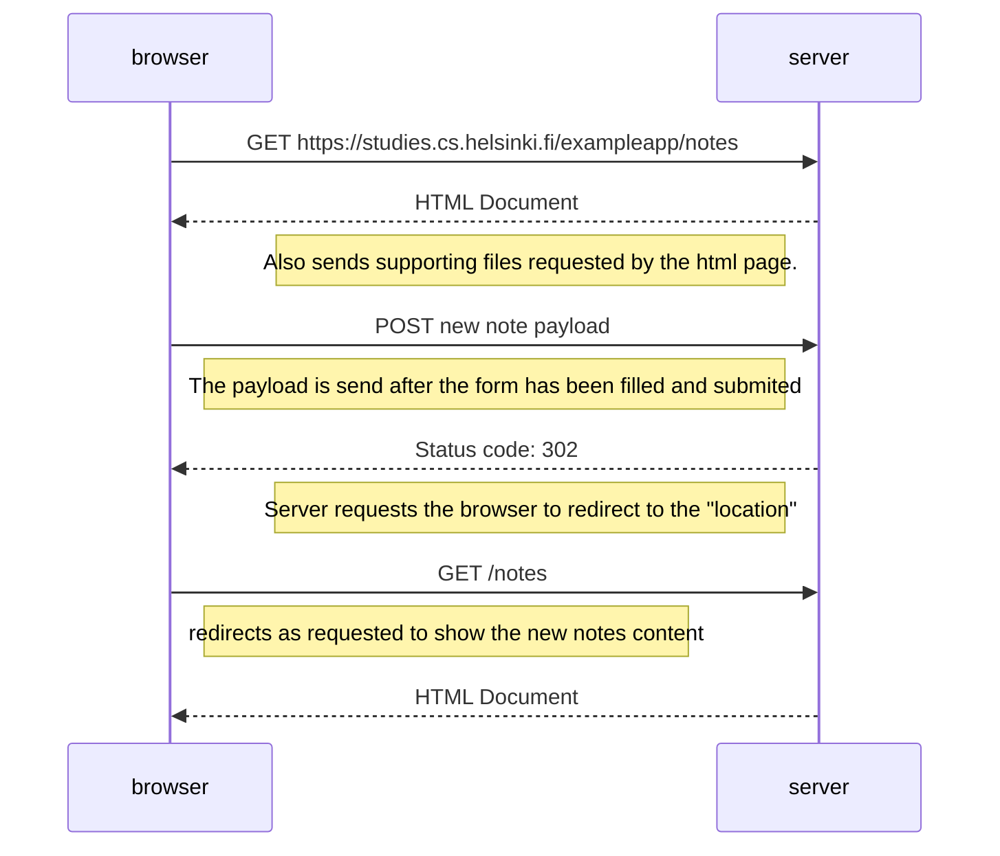

```mermaid
sequenceDiagram

  participant browser
  participant server


  browser->>server: GET https://studies.cs.helsinki.fi/exampleapp/notes
  server-->>browser: HTML Document
  Note left of server: Also sends supporting files requested by the html page.
  browser->>server: POST new note payload
  Note right of browser: The payload is send after the form has been filled and submited
  server-->>browser: Status code: 302
  Note left of server: Server requests the browser to redirect to the "location" 
  browser->>server: GET  /notes
  Note right of browser: redirects as requested to show the new notes content
  server-->>browser: HTML Document
```